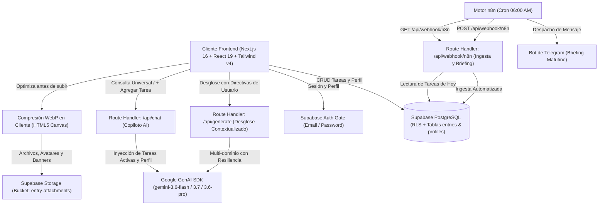

# Second Brain - Sistema Operativo de Ejecución Diaria & Copiloto Cognitivo

[](https://nextjs.org/)
[](https://react.dev/)
[](https://tailwindcss.com/)
[](https://www.typescriptlang.org/)
[](https://supabase.com/)
[](https://ai.google.dev/)
[](https://n8n.io/)
[](https://opensource.org/licenses/MIT)

---

## 1. Descripción General

**Second Brain** es un sistema operativo de productividad personal, ejecución diaria y gestión de conocimiento construido con estética dark mode inspirada en *Linear* y *Raycast*. Integra un **Copiloto AI Universal** conectado a Google Gemini (serie 3.x), un motor de desgloses de subtareas contextualizadas, almacenamiento relacional en Supabase con autenticación y Row Level Security (RLS), optimización y compresión de multimedia en cliente a WebP, y flujos de automatización programada en n8n conectados con Telegram.

---

## 2. Arquitectura del Sistema



---

## 3. Matriz de Productividad Bidimensional

La aplicación organiza la captura y ejecución mediante una matriz cruzada de 5 Áreas de Enfoque y 4 Horizontes Temporales:

### Áreas de Enfoque

| Identificador | Nombre Visible | Propósito | Acento Visual |
| :--- | :--- | :--- | :--- |
| `trabajo` | Trabajo | Proyectos laborales, entregables técnicos y código | Azul Cielo (`#38bdf8`) |
| `universidad` | Universidad | Asignaturas, lecturas académicas e investigación | Esmeralda (`#34d399`) |
| `gimnasio` | Gimnasio | Rutinas de entrenamiento, ejercicios y series | Rosa (`#f43f5e`) |
| `cashea` | Cashea / Finanzas | Fechas de corte, control de cuotas y presupuestos | Ámbar (`#eab308`) |
| `personal` | Personal & AI | Hábitos, directivas de IA y proyectos propios | Índigo (`#818cf8`) |

### Horizontes Temporales

| Identificador | Nombre Visible | Propósito |
| :--- | :--- | :--- |
| `hoy` | Hoy | Tareas y compromisos de ejecución inmediata durante el día |
| `corto` | Corto Plazo | Objetivos para completar durante la semana en curso |
| `mediano` | Mediano Plazo | Metas del mes o sprints activos de desarrollo |
| `largo` | Largo Plazo | Proyectos trimestrales, hitos estratégicos y aprendizaje profundo |

---

## 4. Características Principales

### A. Copiloto AI Universal (`/api/chat`)
* **Asistente Conversacional Integral:** Responde dudas sobre desarrollo, fitness, finanzas, estudio o tus propias tareas activas.
* **Acción Interactiva de Creación de Tareas:** Genera bloques estructurados `task_action` con un botón `[+ Agregar a mi Workspace]` para insertar tareas en Supabase con 1 clic sin salir del chat.

### B. Modal de Perfil & Contexto de IA (`ProfileSettingsModal.tsx`)
* **Header Visual con Banner y Avatar:** Portada panorámica y foto de perfil en tiempo real.
* **Optimización WebP en Cliente:** Compresión en canvas antes de la subida a Supabase Storage (< 150 KB por imagen) para carga instantánea y cero sobrecosto de ancho de banda.
* **Contexto de IA Persistente:** Configuración de Profesión/Rol, Metas Principales y Directivas de Estilo que personalizan automáticamente el tono de Gemini en toda la aplicación.

### C. Desglose de Subtareas con Contexto de Usuario
* En el drawer de detalle de cada tarea (`EntryDetailDrawer.tsx`), el usuario puede especificar directivas precisas (ej: *"Formato APA, 3 entregas y rúbrica del profesor"*) para que la IA genere un desglose exacto y accionable.

### D. Refinamiento Visual y Micro-Interacciones
* Bordes laterales de acento por área en cada tarea.
* Badges de conteo de tareas pendientes en tiempo real en la barra lateral.
* Micro-indicador de progreso de subtareas (`3/5 listas`).
* Fechas límite (`due_date`) con estados de vencimiento (*Vencida*, *Vence Hoy*, *Fecha*).
* Subida de archivos adjuntos a Supabase Storage.

---

## 5. Especificación de Endpoints Backend

### 1. `/api/chat` (POST)
Endpoint de conversación del Copiloto AI. Inyecta el perfil del usuario y sus tareas activas en el prompt de Gemini.

* **Payload:**
  ```json
  {
    "messages": [
      { "role": "user", "content": "¿Qué pendientes tengo para hoy y anota planificar la reunión?" }
    ],
    "tasks": [ ... ],
    "aiContext": {
      "profession": "Desarrollador Full-Stack",
      "goals": "Lanzar SaaS",
      "custom_instructions": "Respuestas concisas"
    }
  }
  ```
* **Respuesta:** Texto formateado con soporte para bloques `task_action`.

### 2. `/api/generate` (POST)
Endpoint para sugerencias de títulos y desgloses estructurados en bloques heterogéneos (`heading`, `paragraph`, `todo`, `bullet`, `code`, `callout`).

* **Payload (Desglose con Contexto de Usuario):**
  ```json
  {
    "mode": "breakdown",
    "input": "Proyecto Final de Algoritmos",
    "area": "universidad",
    "horizon": "mediano",
    "userNotes": "Normas IEEE, lenguaje Rust, 4 fases de entrega",
    "aiContext": { ... }
  }
  ```

### 3. `/api/webhook/n8n` (GET / POST)
Endpoint autenticado mediante cabecera `x-n8n-api-key` para integración con flujos de n8n y bots de Telegram.

---

## 6. Instalación y Configuración Local

### Requisitos Previos
* **Node.js**: v20 o superior
* **pnpm**: v10 o v11
* **Supabase**: Proyecto activo con PostgreSQL y Storage
* **Google AI Studio**: API Key con acceso a modelos Gemini 3.x

### Pasos de Instalación

1. **Clonar el repositorio:**
   ```bash
   git clone https://github.com/GaboInsane6489/MiHogarSeguro.git
   cd MiHogarSeguro
   ```

2. **Instalar dependencias:**
   ```bash
   pnpm install
   ```

3. **Configurar variables de entorno:**
   Crear el archivo `.env.local` basado en `.env.example`:
   ```env
   NEXT_PUBLIC_SUPABASE_URL=https://tu-proyecto.supabase.co
   NEXT_PUBLIC_SUPABASE_ANON_KEY=tu_supabase_anon_key
   GEMINI_API_KEY=tu_gemini_api_key
   N8N_API_KEY=tu_token_secreto_para_n8n
   ```

4. **Aplicar migraciones en Supabase:**
   Ejecutar los scripts de la carpeta `supabase/migrations/` en el SQL Editor de Supabase:
   * `20260815_create_entries_table.sql`
   * `20260821_create_profiles_table.sql`
   * `20260822_profile_banner.sql`

5. **Configurar Supabase Storage:**
   * Crear un bucket público llamado `entry-attachments`.
   * Habilitar políticas de lectura pública e inserción/actualización autenticada.

6. **Iniciar servidor de desarrollo:**
   ```bash
   pnpm run dev
   ```
   Abrir [http://localhost:3000](http://localhost:3000) en el navegador.

---

## 7. Automatización con n8n y Telegram

* **Workflow Blueprint:** `docs/n8n_daily_briefing_workflow.json`
* **Guía de Configuración:** `docs/n8n_setup.md`

El flujo consulta diariamente a las 06:00 AM las tareas del horizonte `hoy`, las agrupa por área y las envía formateadas a un chat de Telegram.

---

## 8. Licencia

Este proyecto está bajo los términos de la Licencia MIT. Consulte el archivo [LICENSE](LICENSE) para más información.
