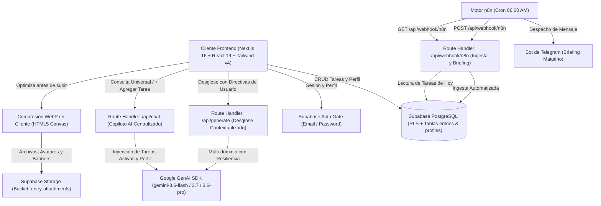

# Second Brain - Sistema Operativo de Ejecución Diaria & Copiloto Cognitivo

<div align="center">

[](https://nextjs.org/)
[](https://react.dev/)
[](https://tailwindcss.com/)
[](https://www.typescriptlang.org/)
[](https://supabase.com/)
[](https://ai.google.dev/)
[](https://n8n.io/)
[](https://opensource.org/licenses/MIT)

**[Documentación](file:///c:/GithubProjects/mi-app-diaria/README.md)** • **[Guía de Contribución](file:///c:/GithubProjects/mi-app-diaria/CONTRIBUTING.md)** • **[Roadmap Oficial & Changelog](file:///c:/GithubProjects/mi-app-diaria/ROADMAP.md)** • **[Licencia MIT](file:///c:/GithubProjects/mi-app-diaria/LICENSE)**

</div>

---

## 1. Descripción General

**Second Brain** es un sistema operativo de productividad personal, ejecución diaria y gestión de conocimiento construido con estética *Dark Titanium* inspirada en *Linear* y *Raycast*. Integra un **Copiloto AI Universal** conectado a Google Gemini (serie 3.x), un motor de desgloses de subtareas contextualizadas, almacenamiento relacional en Supabase con autenticación y Row Level Security (RLS), optimización y compresión de imágenes en cliente a formato WebP, y flujos de automatización programada en n8n conectados con Telegram.

---

## 2. Arquitectura del Sistema



---

## 3. Matriz de Productividad Bidimensional

La aplicación organiza la captura y ejecución mediante una matriz cruzada de 5 Áreas de Enfoque y 4 Horizontes Temporales:

### Áreas de Enfoque

| Identificador | Nombre Visible | Propósito | Acento Visual |
| :--- | :--- | :--- | :--- |
| `trabajo` | Trabajo | Proyectos laborales, entregables técnicos y código | Azul Cielo (`#38bdf8`) |
| `universidad` | Universidad | Asignaturas, lecturas académicas e investigación | Esmeralda (`#34d399`) |
| `gimnasio` | Gimnasio | Rutinas de entrenamiento, ejercicios y series | Rosa (`#f43f5e`) |
| `cashea` | Cashea / Finanzas | Fechas de corte, control de cuotas y presupuestos | Ámbar (`#eab308`) |
| `personal` | Personal & AI | Hábitos, directivas de IA y proyectos propios | Índigo (`#818cf8`) |

### Horizontes Temporales

| Identificador | Nombre Visible | Propósito |
| :--- | :--- | :--- |
| `hoy` | Hoy | Tareas y compromisos de ejecución inmediata durante el día |
| `corto` | Corto Plazo | Objetivos para completar durante la semana en curso |
| `mediano` | Mediano Plazo | Metas del mes o sprints activos de desarrollo |
| `largo` | Largo Plazo | Proyectos trimestrales, hitos estratégicos y aprendizaje profundo |

---

## 4. Características Principales

### A. Copiloto AI Centralizado (`SecondBrainChatDrawer.tsx` & `/api/chat`)
* **Consola Ejecutiva Flotante:** Modal centralizado espacioso con estado en vivo (*Online*), conteo de tareas activas en memoria y persistencia de conversación.
* **Acción Interactiva de Creación de Tareas:** Detección de intenciones que genera tarjetas interactivas de tareas con un botón `+ Agregar a mi Workspace` para insertar tareas en Supabase con 1 clic sin salir del chat.

### B. Modal Centralizado de Tareas & Desglose Contextual (`EntryDetailDrawer.tsx`)
* **Edición Integral:** Fecha límite (`due_date`), prioridad con banderas de color, área y horizonte.
* **Desglose Estructurado con Directivas de Usuario:** Botón `+ Contexto IA` para ingresar directivas personalizadas antes de invocar a Gemini.
* **Galería Multimedia:** Carga de archivos adjuntos con miniaturas en Supabase Storage.

### C. Ajustes de Perfil & Fondo Fijo Personalizado (`ProfileSettingsModal.tsx`)
* **Wallpaper y Avatar con Compresión en Cliente:** Motor canvas de optimización a formato WebP (< 150 KB).
* **Fondo de Pantalla Fijo con Paneles de Alto Contraste:** El wallpaper cargado luce de fondo mientras todo el workspace flota con legibilidad cristalina y nítida.
* **Contexto de IA Persistente:** Configuración de Profesión/Rol, Metas Principales y Directivas de Estilo que personalizan automáticamente el tono de Gemini.

### D. Experiencia Multi-Dispositivo & Responsive
* **Command Hub Móvil de Pantalla Completa:** Menú táctil para smartphones con acceso rápido a las 5 áreas, horizontes y copiloto.
* **Sidebar Fijo en Escritorio:** Ancho optimizado de 80px (colapsado) y 256px (expandido) para flujo de trabajo ágil.

---

## 5. Pila Tecnológica

* **Framework:** [Next.js 16 (App Router + Turbopack)](https://nextjs.org/)
* **Librería de UI:** [React 19](https://react.dev/)
* **Estilos:** [Tailwind CSS v4](https://tailwindcss.com/)
* **Tipado:** [TypeScript 5.x](https://www.typescriptlang.org/)
* **Base de Datos & Auth:** [Supabase (PostgreSQL + RLS + Storage)](https://supabase.com/)
* **Inteligencia Artificial:** [Google GenAI SDK (Gemini 3.6 Flash / 3.7 / 3.6 Pro)](https://ai.google.dev/)
* **Automatización Externa:** [n8n Workflow Engine](https://n8n.io/)
* **Iconografía:** [Lucide React](https://lucide.dev/) + Isotipo Vectorial Oficial Second Brain

---

## 6. Instalación y Puesta en Marcha

### Prerrequisitos
* Node.js >= 20.x
* pnpm >= 9.x
* Cuenta de Supabase con proyecto activo
* API Key de Google Gemini

### 1. Clonar el repositorio
```bash
git clone https://github.com/GaboInsane6489/MiHogarSeguro.git
cd MiHogarSeguro
```

### 2. Instalar dependencias
```bash
pnpm install
```

### 3. Configurar variables de entorno
Crea un archivo `.env.local` basado en `.env.example`:
```env
NEXT_PUBLIC_SUPABASE_URL=https://tu-proyecto.supabase.co
NEXT_PUBLIC_SUPABASE_ANON_KEY=tu-anon-key
SUPABASE_SERVICE_ROLE_KEY=tu-service-role-key
GEMINI_API_KEY=tu-gemini-api-key
N8N_WEBHOOK_SECRET=tu-secreto-para-webhooks
```

### 4. Ejecutar migraciones de Supabase
Aplica los esquemas SQL ubicados en `supabase/migrations/`:
```bash
# Ejecutar en el SQL Editor de tu Dashboard de Supabase
supabase/migrations/20260822_profile_banner.sql
```

### 5. Iniciar el servidor de desarrollo
```bash
pnpm dev
```
Abre [http://localhost:3000](http://localhost:3000) en tu navegador.

---

## 7. Estructura del Repositorio

```text
├── src/
│   ├── app/
│   │   ├── api/
│   │   │   ├── chat/route.ts          # Endpoint del Copiloto AI
│   │   │   ├── generate/route.ts      # Endpoint de desglose estructurado
│   │   │   └── webhook/n8n/route.ts   # Endpoint de integración con n8n
│   │   ├── globals.css                # Tokens de Tailwind v4 y estilos base
│   │   ├── layout.tsx                 # Layout raíz con metadatos
│   │   ├── login/page.tsx             # Pantalla de autenticación
│   │   └── page.tsx                   # Workspace principal de ejecución
│   ├── components/
│   │   ├── AiTaskInput.tsx            # Formulario de captura rápida
│   │   ├── AuthModal.tsx              # Modal de login/registro
│   │   ├── BrandLogo.tsx              # Isotipo vectorial con IDs únicos
│   │   ├── EntryDetailDrawer.tsx      # Modal centralizado de detalle de tarea
│   │   ├── ProfileSettingsModal.tsx   # Modal de perfil y contexto de IA
│   │   ├── SecondBrainChatDrawer.tsx  # Modal centralizado de Copiloto AI
│   │   └── Sidebar.tsx                # Navegación unificada desktop/móvil
│   ├── lib/
│   │   ├── imageOptimizer.ts          # Compresión Canvas WebP en cliente
│   │   └── supabase.ts                # Clientes Supabase browser y admin
│   └── types/
│       └── database.types.ts          # Tipos TypeScript de Supabase y esquemas
├── supabase/
│   └── migrations/                    # Scripts SQL de migraciones
├── CONTRIBUTING.md                    # Guía para desarrolladores y flujo Git
├── ROADMAP.md                         # Registro de objetivos y changelog
├── LICENSE                            # Licencia MIT
└── README.md                          # Documento principal del repositorio
```

---

## 8. Roadmap & Objetivos Futuros

Consulta nuestro documento **[ROADMAP.md](file:///c:/GithubProjects/mi-app-diaria/ROADMAP.md)** para conocer el plan de evolución que incluye:
* Copiloto Autónomo con llamadas a funciones (*Function Calling*).
* Captura directa con cámara móvil y OCR inteligente.
* Gamificación con sistema de XP, niveles y Leaderboard social de productividad.
* Módulos dedicados con rutas especializadas para Gimnasio (`/gym`), Cashea/Finanzas (`/finance`) y Universidad (`/university`).

---

## 9. Licencia

Este proyecto está bajo la Licencia MIT. Consulta el archivo **[LICENSE](file:///c:/GithubProjects/mi-app-diaria/LICENSE)** para más detalles.
