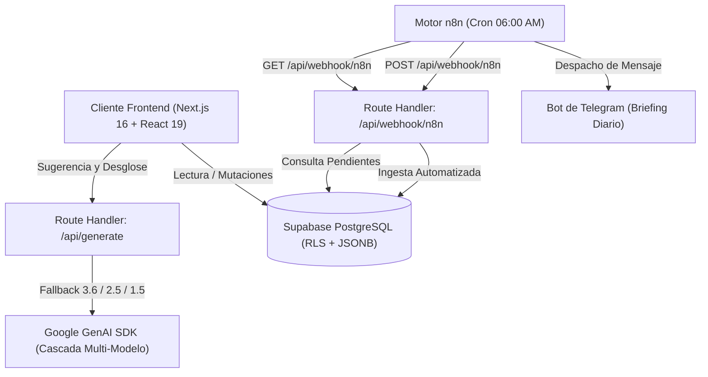

# Second Brain - Personal Task & Execution Operating System

[](https://nextjs.org/)
[](https://react.dev/)
[](https://tailwindcss.com/)
[](https://www.typescriptlang.org/)
[](https://supabase.com/)
[](https://ai.google.dev/)
[](https://n8n.io/)
[](https://opensource.org/licenses/MIT)

---

## Descripcion General

Second Brain es un sistema operativo de ejecucion diaria y gestion de conocimiento personal disenado bajo principios de productividad modular tipo Notion. Integra una interfaz en Dark Mode construida con Tailwind CSS v4, almacenamiento relacional en Supabase con Row Level Security (RLS), generacion cognitiva y estructuracion de tareas con Google Gemini AI, y automatizacion programada mediante flujos en n8n conectados a Telegram.

---

## Arquitectura del Sistema



---

## Modelo de Dominio

La aplicacion clasifica las entradas mediante una matriz bidimensional compuesta por 5 Areas de Enfoque y 4 Horizontes Temporales de Ejecucion.

### Areas de Enfoque

| Identificador | Nombre Visible    | Proposito                                           | Estilo Tokenizado             |
| :------------ | :---------------- | :-------------------------------------------------- | :---------------------------- |
| `trabajo`     | Trabajo           | Proyectos laborales, entregables y tareas tecnicas  | `--color-work: #38bdf8`       |
| `universidad` | Universidad       | Asignaturas, lecturas academicas y evaluaciones     | `--color-university: #34d399` |
| `gimnasio`    | Gimnasio          | Rutinas de entrenamiento, series y recuperacion     | `--color-gym: #f43f5e`        |
| `cashea`      | Cashea / Finanzas | Fechas de corte, control de cuotas y presupuestos   | `--color-finance: #eab308`    |
| `personal`    | Personal & AI     | Habitos, notas de investigacion y proyectos propios | `--color-ai: #8b5cf6`         |

### Horizontes Temporales

| Identificador | Nombre Visible | Descripcion                                                |
| :------------ | :------------- | :--------------------------------------------------------- |
| `hoy`         | Hoy            | Tareas y compromisos a ejecutar durante la jornada actual  |
| `corto`       | Corto Plazo    | Objetivos a completar durante la semana en curso           |
| `mediano`     | Mediano Plazo  | Metas del mes o sprints de desarrollo activos              |
| `largo`       | Largo Plazo    | Proyectos trimestrales, hitos estrategicos e investigacion |

---

## Especificacion de Endpoints Backend

### 1. `/api/generate` (POST)

Invoca a Google Gemini con Structured Outputs y una cascada de resiliencia automatica (`gemini-3.6-flash` -> `gemini-2.5-flash` -> `gemini-1.5-flash`) para absorber errores 503/429.

- **Modo `suggest`:**
  - Request: `{ "mode": "suggest", "input": "string", "area": "AreaType", "horizon": "HorizonType" }`
  - Response: `{ "title": "Titulo conciso optimizado", "text": "Titulo conciso optimizado" }`
- **Modo `breakdown`:**
  - Request: `{ "mode": "breakdown", "input": "string", "area": "AreaType", "horizon": "HorizonType" }`
  - Response: `{ "title": "Titulo optimizado", "blocks": [{ "id": "string", "type": "todo|paragraph|bullet|callout", "content": "string" }] }`

### 2. `/api/webhook/n8n` (GET / POST)

Endpoint autenticado mediante cabecera `x-n8n-api-key`.

- **POST (Creacion de Entrada):**
  - Headers: `x-n8n-api-key: <N8N_API_KEY>`
  - Request: `{ "title": "string", "area": "AreaType", "horizon": "HorizonType", "content": [], "metadata": {} }`
  - Response: Status 201 `{ "success": true, "data": { ... } }`
- **GET (Consulta de Pendientes):**
  - Headers: `x-n8n-api-key: <N8N_API_KEY>`
  - Params: `?horizon=hoy&area=trabajo` (opcionales)
  - Response: Status 200 `{ "success": true, "total": 3, "entries": [ ... ] }`

---

## Instalacion y Configuracion Local

### Requisitos Previos

- Node.js 20 o superior
- pnpm 11 o superior
- Proyecto activo en Supabase
- Clave de API en Google AI Studio

### Pasos de Instalacion

1. **Clonar el repositorio:**

   ```bash
   git clone https://github.com/GaboInsane6489/MiHogarSeguro.git
   cd MiHogarSeguro
   ```

2. **Instalar dependencias:**

   ```bash
   pnpm install
   ```

3. **Configurar variables de entorno:**

   ```bash
   cp .env.example .env.local
   ```

   Completar las credenciales en `.env.local`:
   - `NEXT_PUBLIC_SUPABASE_URL`
   - `NEXT_PUBLIC_SUPABASE_ANON_KEY`
   - `GEMINI_API_KEY`
   - `N8N_API_KEY`

4. **Ejecutar migraciones en Supabase:**
   Aplicar el script SQL ubicado en `supabase/migrations/20260815_create_entries_table.sql` desde el SQL Editor de la consola de Supabase.

5. **Iniciar el servidor de desarrollo:**
   ```bash
   pnpm run dev
   ```
   Abrir [http://localhost:3000](http://localhost:3000) en el navegador.

---

## Automatizacion con n8n y Telegram

El proyecto incluye la definicion completa del flujo de briefing matutino:

- Blueprint oficial: `docs/n8n_daily_briefing_workflow.json`
- Guia de configuracion: `docs/n8n_setup.md`

El workflow consulta las tareas del horizonte `hoy` cada dia a las 06:00 AM, las formatea agrupadas por area funcional y las despacha al chat de Telegram configurado.

---

## Licencia

Este proyecto esta licenciado bajo los terminos de la Licencia MIT. Consulte el archivo [LICENSE](LICENSE) para mas detalles.
